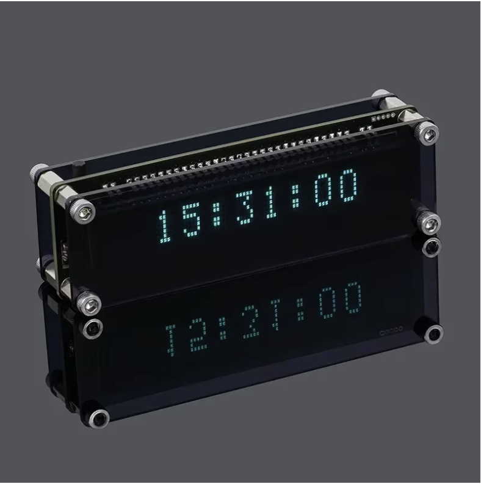
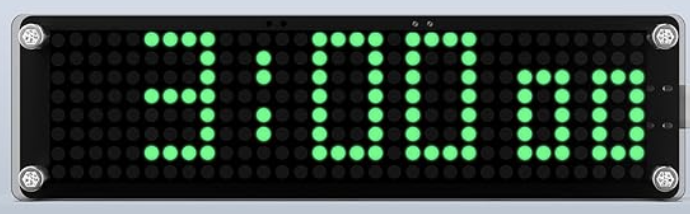

# ⏰ SyncChronos

An ESP8266-based Internet Clock with **DS3231 RTC backup**, supporting both **FUTABA VFD** and **MAX7219 LED Matrix** displays.

| VFD Display | LED Matrix (MAX7219) |
|:---:|:---:|
|  |  |

## ✨ Features

| Feature | Description |
|---------|-------------|
| 🕐 **NTP Time Sync** | Automatic synchronization via WiFi |
| 🔋 **DS3231 RTC** | Battery-backed hardware clock for time persistence |
| 🌡️ **Live Weather** | Real-time data from OpenWeatherMap |
| 🌍 **Web Portal** | Configure everything via browser |
| 🔄 **Auto-Rotate** | Tilt sensor support for display rotation |
| 📺 **Dual Display** | VFD or MAX7219 LED matrix |
| 💡 **Brightness** | Adjustable via web UI or serial |
| 💾 **Persistent Config** | Settings saved to flash |

## 🔧 Hardware

### ESP8266 Pinout

| Function | ESP8266 | GPIO |
|----------|---------|------|
| Display CS | D8 | 15 |
| Display CLK | D5 | 14 |
| Display DIN | D7 | 13 |
| VFD Reset | D6 | 12 |
| RTC SDA | D2 | 4 |
| RTC SCL | D1 | 5 |
| Tilt Sensor | Configurable | - |

### Supported Hardware
- **VFD**: FUTABA 8-MD-06INKM (default)
- **LED Matrix**: MAX7219 4x8x8 modules
- **RTC**: DS3231 (optional, for time persistence)
- **Tilt Sensor**: Digital tilt switch (optional, for auto-rotation)

## 🚀 Quick Start

```bash
# Clone
git clone https://github.com/tahaeghtesad/SyncChronos.git
cd SyncChronos

# Build & Upload VFD firmware
make upload

# Or for MAX7219 display
make upload-max

# Monitor serial output
make monitor
```

## 📁 Project Structure

```
SyncChronos/
├── src/
│   ├── main.cpp              # Application entry point
│   ├── config.h              # Compile-time defaults
│   ├── config_manager.*      # Persistent settings (LittleFS + JSON)
│   ├── time_manager.*        # NTP sync & time handling
│   ├── clock_source.h        # Clock source interface
│   ├── esp8266_clock.*       # Software clock (millis-based)
│   ├── ds3231_clock.*        # DS3231 RTC clock
│   ├── display_driver.h      # Display abstraction
│   ├── vfd_driver.*          # FUTABA VFD driver
│   ├── max7219_driver.*      # LED matrix driver
│   ├── tilt_sensor.*         # Orientation detection
│   ├── weather_manager.*     # OpenWeatherMap integration
│   ├── wifi_manager.*        # WiFi connection handling
│   └── web_server.*          # Configuration web portal
├── test/                     # Unit tests
├── .github/workflows/        # CI/CD pipelines
├── platformio.ini            # Build configuration
└── Makefile                  # Convenience commands
```

## ⚙️ Configuration

### First Boot
Connect to `VFD-Clock-Setup` WiFi AP → Open `http://192.168.4.1`

### Web Portal Settings
- **WiFi** - SSID & password
- **Time** - NTP server, timezone
- **Display** - Brightness, show seconds
- **Weather** - API key, location, units
- **Hardware** - Clock source, tilt sensor pin, auto-rotate

### Compile-Time Config
Edit `src/config.h` for default values.

## 🛠️ Makefile Commands

| Command | Description |
|---------|-------------|
| `make build` | Build all firmware variants |
| `make upload` | Upload VFD firmware |
| `make upload-max` | Upload MAX7219 firmware |
| `make monitor` | Serial monitor (115200) |
| `make run` | Upload + monitor |
| `make test` | Run native tests |
| `make release` | Create release binaries |
| `make clean` | Clean build artifacts |

## 🧪 Testing

```bash
# Native tests (runs on host)
make test-native

# Embedded tests (runs on device)
make test-embedded

# Verify API keys
make verify
```

## 📟 Serial Commands

| Key | Action |
|-----|--------|
| `t` | Time mode |
| `d` | Date mode |
| `s` | Seconds mode |
| `w` | Weather mode |
| `+` `-` | Brightness ±16 |
| `r` | Resync NTP |

## 🔄 CI/CD

- **CI**: Runs tests on every push
- **CD**: Auto-releases firmware on push to `main`
  - Dev builds: `dev-<sha>` (pre-release)
  - Stable builds: `v*` tags (release)

## 📄 License

MIT License - See [LICENSE](LICENSE)
